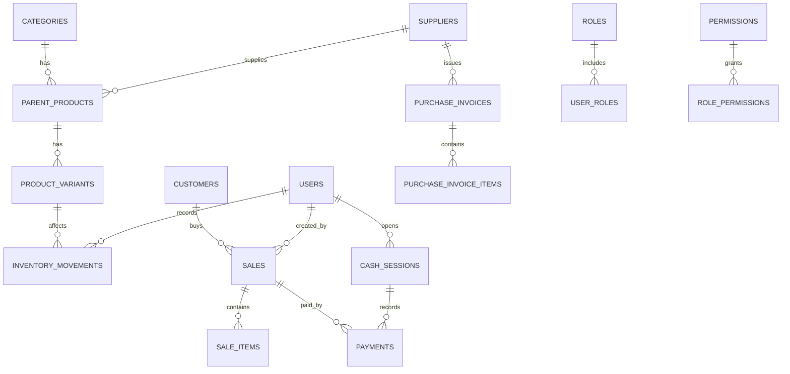

# Database Schema (SQLite) — Clothes POS

This document provides an ERD overview and the initial DDL (in docs/db/schema.sql). It follows best practices for POS: variants, movements, purchases, sales, payments, users/roles, cash sessions, settings, and auditing.

## ERD Overview (Mermaid)

Key rules:
- All stock changes are captured in INVENTORY_MOVEMENTS, never direct edits without a reason.
- Negative stock is disallowed at the service layer.
- SKUs and barcodes are unique per variant.
- Returns are modeled as movements and linked records, never in-place edits of completed sales.

## DDL
See docs/db/schema.sql for full SQL with indices and constraints.

